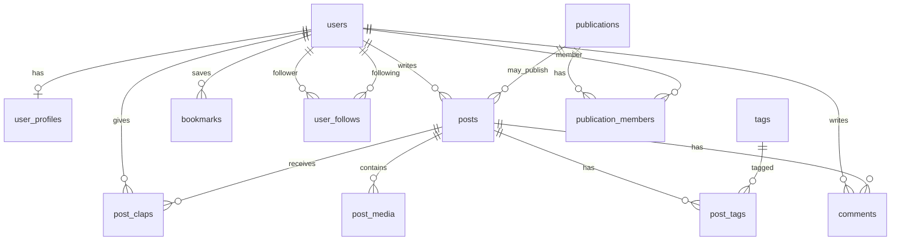

# Database schema — blog kiểu Medium

Tài liệu mô tả mô hình dữ liệu tập trung vào các chức năng chính: **bài viết**, **người dùng & hồ sơ**, **tương tác (clap, bình luận, bookmark)**, **theo dõi**, **phân loại (tag/topic)**. Thiết kế hướng tới **PostgreSQL** (chuẩn production: ACID, JSONB, full-text search, constraint rõ ràng).

---

## 1. Nguyên tắc production

| Nguyên tắc | Ghi chú |
|------------|---------|
| Khóa chính | `uuid` (gen random) cho ID lộ ra API; tránh lộ sequence. |
| Thời gian | `timestamptz` cho mọi mốc thời gian. |
| Soft delete | Cột `deleted_at` cho nội dung người dùng xóa (post, comment) khi cần tuân thủ/khôi phục. |
| Slug | `UNIQUE` trong phạm vi phù hợp (global hoặc theo publication). |
| Đếm denormalized | `clap_count`, `response_count` trên `posts` cập nhật bằng transaction hoặc job (tránh COUNT(*) mọi request). |
| Full-text search | Index `GIN` trên `tsvector` hoặc dịch vụ ngoài (OpenSearch/Meilisearch) — bảng giữ nội dung nguồn, search sync async. |
| Ảnh/file | URL + metadata trong DB; file thực tế ở object storage (S3, R2). |

---

## 2. Sơ đồ quan hệ (khái niệm)

---

## 3. Bảng chi tiết

### 3.1 `users`

Xác thực và định danh tài khoản (tách khỏi hồ sơ hiển thị).

| Cột | Kiểu | Ràng buộc / Ghi chú |
|-----|------|---------------------|
| `id` | `uuid` | PK, default `gen_random_uuid()` |
| `email` | `citext` hoặc `text` | `UNIQUE`, NOT NULL |
| `email_verified_at` | `timestamptz` | NULL nếu chưa xác minh |
| `password_hash` | `text` | NULL nếu chỉ OAuth |
| `created_at` | `timestamptz` | NOT NULL, default `now()` |
| `updated_at` | `timestamptz` | NOT NULL |

**Index:** `UNIQUE(email)`.

---

### 3.2 `user_profiles`

Thông tin hiển thị công khai (tách để giảm độ rộng bảng `users` và cho phép mở rộng).

| Cột | Kiểu | Ghi chú |
|-----|------|---------|
| `user_id` | `uuid` | PK, FK → `users(id)` ON DELETE CASCADE |
| `display_name` | `text` | NOT NULL |
| `username` | `text` | `UNIQUE`, NOT NULL — dùng cho URL `@username` |
| `bio` | `text` | |
| `avatar_url` | `text` | URL storage |
| `created_at` | `timestamptz` | |
| `updated_at` | `timestamptz` | |

**Index:** `UNIQUE(username)`.

---

### 3.3 `posts`

Bài viết (trạng thái draft/published/archived).

| Cột | Kiểu | Ghi chú |
|-----|------|---------|
| `id` | `uuid` | PK |
| `author_id` | `uuid` | FK → `users(id)`, NOT NULL |
| `publication_id` | `uuid` | FK → `publications(id)`, NULL — bài cá nhân |
| `title` | `text` | NOT NULL |
| `slug` | `text` | NOT NULL — kết hợp unique theo quy tắc dưới |
| `subtitle` | `text` | |
| `body` | `text` hoặc `jsonb` | Markdown/HTML hoặc block JSON (editor) |
| `excerpt` | `text` | Tóm tắt listing |
| `cover_image_url` | `text` | |
| `status` | `text` | CHECK: `draft` \| `published` \| `unlisted` \| `archived` |
| `published_at` | `timestamptz` | NULL khi draft |
| `reading_time_minutes` | `smallint` | Denormalized, tính khi save |
| `clap_count` | `integer` | NOT NULL default 0 |
| `response_count` | `integer` | NOT NULL default 0 — số comment top-level hoặc tổng (quy ước cố định) |
| `deleted_at` | `timestamptz` | Soft delete |
| `created_at` | `timestamptz` | |
| `updated_at` | `timestamptz` | |

**Unique slug (khuyến nghị):**

- Bài cá nhân: `UNIQUE (author_id, slug)` **hoặc**
- Có publication: `UNIQUE (publication_id, slug)` với `publication_id` NOT NULL; bài không thuộc publication dùng `(author_id, slug)` khi `publication_id` IS NULL.

**Index (đọc feed / listing):**

- `(status, published_at DESC)` WHERE `status = 'published'` (partial index).
- `(author_id, published_at DESC)`.
- `(publication_id, published_at DESC)` WHERE `publication_id IS NOT NULL`.

---

### 3.4 `post_revisions` (tùy chọn, mạnh cho draft history)

| Cột | Kiểu | Ghi chú |
|-----|------|---------|
| `id` | `uuid` | PK |
| `post_id` | `uuid` | FK → `posts(id)` ON DELETE CASCADE |
| `body` | `text` / `jsonb` | Snapshot |
| `title` | `text` | |
| `created_at` | `timestamptz` | Thời điểm lưu revision |

**Index:** `(post_id, created_at DESC)`.

---

### 3.5 `tags` & `post_tags`

| `tags` | |
|--------|--|
| `id` | `uuid` PK |
| `name` | `text` UNIQUE — tên hiển thị |
| `slug` | `text` UNIQUE — URL-friendly |

| `post_tags` | |
|-------------|--|
| `post_id` | `uuid` FK → `posts(id)` ON DELETE CASCADE |
| `tag_id` | `uuid` FK → `tags(id)` ON DELETE CASCADE |

**PK:** `(post_id, tag_id)`.

---

### 3.6 `comments`

Bình luận (thread: trả lời comment khác).

| Cột | Kiểu | Ghi chú |
|-----|------|---------|
| `id` | `uuid` | PK |
| `post_id` | `uuid` | FK → `posts(id)` ON DELETE CASCADE |
| `author_id` | `uuid` | FK → `users(id)` |
| `parent_id` | `uuid` | FK → `comments(id)` ON DELETE CASCADE, NULL = root |
| `body` | `text` | NOT NULL |
| `deleted_at` | `timestamptz` | |
| `created_at` | `timestamptz` | |
| `updated_at` | `timestamptz` | |

**Index:** `(post_id, created_at)`, `(parent_id)` nếu load thread con.

---

### 3.7 `post_claps`

Mỗi user tối đa một “dòng” clap per post; số clap có thể là 1–50 (giống Medium) hoặc chỉ boolean.

| Cột | Kiểu | Ghi chú |
|-----|------|---------|
| `user_id` | `uuid` | FK → `users(id)` ON DELETE CASCADE |
| `post_id` | `uuid` | FK → `posts(id)` ON DELETE CASCADE |
| `count` | `smallint` | CHECK 1–50 hoặc 1 nếu chỉ like |

**PK:** `(user_id, post_id)`.

Cập nhật `posts.clap_count` trong cùng transaction hoặc trigger/job.

---

### 3.8 `bookmarks`

| Cột | Kiểu | Ghi chú |
|-----|------|---------|
| `user_id` | `uuid` | FK → `users(id)` ON DELETE CASCADE |
| `post_id` | `uuid` | FK → `posts(id)` ON DELETE CASCADE |
| `created_at` | `timestamptz` | |

**PK:** `(user_id, post_id)`.

---

### 3.9 `user_follows`

Theo dõi tác giả (user → user).

| Cột | Kiểu | Ghi chú |
|-----|------|---------|
| `follower_id` | `uuid` | FK → `users(id)` ON DELETE CASCADE |
| `following_id` | `uuid` | FK → `users(id)` ON DELETE CASCADE |

**PK:** `(follower_id, following_id)`.

**CHECK:** `follower_id <> following_id`.

**Index:** `(following_id)` cho danh sách follower.

---

### 3.10 `publications` & `publication_members` (tùy chọn — “tạp chí” trên Medium)

**`publications`**

| Cột | Kiểu | Ghi chú |
|-----|------|---------|
| `id` | `uuid` | PK |
| `name` | `text` | |
| `slug` | `text` | UNIQUE |
| `description` | `text` | |
| `avatar_url` | `text` | |
| `created_at` / `updated_at` | `timestamptz` | |

**`publication_members`**

| Cột | Kiểu | Ghi chú |
|-----|------|---------|
| `publication_id` | `uuid` | FK |
| `user_id` | `uuid` | FK |
| `role` | `text` | `owner` \| `editor` \| `writer` |
| `created_at` | `timestamptz` | |

**PK:** `(publication_id, user_id)`.

---

### 3.11 `post_media`

Ảnh/file gắn bài (CDN URL đã upload).

| Cột | Kiểu | Ghi chú |
|-----|------|---------|
| `id` | `uuid` | PK |
| `post_id` | `uuid` | FK → `posts(id)` ON DELETE CASCADE |
| `url` | `text` | NOT NULL |
| `width` / `height` | `integer` | tùy chọn |
| `alt` | `text` | |
| `sort_order` | `integer` | default 0 |

---

### 3.12 `notifications` (tối thiểu production)

| Cột | Kiểu | Ghi chú |
|-----|------|---------|
| `id` | `uuid` | PK |
| `user_id` | `uuid` | FK — người nhận |
| `type` | `text` | `new_follow`, `new_comment`, `new_clap`, … |
| `payload` | `jsonb` | `{ postId, actorId, ... }` |
| `read_at` | `timestamptz` | NULL = chưa đọc |
| `created_at` | `timestamptz` | |

**Index:** `(user_id, read_at NULLS FIRST, created_at DESC)` hoặc partial index unread.

---

## 4. OAuth / session (nếu cần trong cùng DB)

- **`oauth_accounts`**: `user_id`, `provider`, `provider_user_id`, `UNIQUE(provider, provider_user_id)`.
- **`sessions` hoặc refresh tokens**: `user_id`, `token_hash`, `expires_at`, `revoked_at`.

---

## 5. Thứ tự triển khai (migration)

1. `users` → `user_profiles`
2. `publications`, `publication_members` (nếu dùng)
3. `posts` → `post_tags`, `tags` (tags trước hoặc cùng lúc)
4. `post_claps`, `comments`, `bookmarks`, `user_follows`
5. `post_media`, `post_revisions`, `notifications`

---

## 6. Ghi chú mở rộng (không bắt buộc giai đoạn đầu)

- **Báo cáo / moderation:** `reports` (target_type, target_id, reporter_id, status).
- **Series:** bảng `series`, `series_posts` (thứ tự trong series).
- **Paywall / membership:** bảng `subscriptions`, `plans` — phụ thuộc mô hình kinh doanh.
- **Analytics:** event table hoặc gửi sang warehouse (BigQuery, v.v.) thay vì query trực tiếp trên OLTP nặng.

Tài liệu này là **đặc tả logic**; DDL cụ thể (trigger, RLS Supabase, v.v.) nên sinh từ migration tool (Prisma, Drizzle, Flyway, v.v.) và giữ đồng bộ với code.
